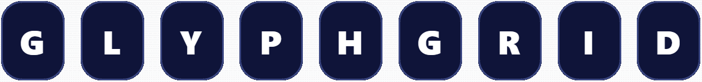

# GlyphGrid

**GlyphGrid** is a manual cryptogram workbench built for solvers, puzzle designers, and ARG creators. It provides a hands-on interface for exploring letter substitutions, enforcing one-to-one mappings, and analyzing ciphertext patterns — all locally in your browser.

[**View Live Demo**](https://nqrlabs.com/GlyphGrid/)

## Overview

GlyphGrid combines the tactile logic of pen-and-paper solving with the convenience of digital tools. Paste or generate ciphertext, map letters using your keyboard, and watch updates ripple through every instance automatically.  
The workspace highlights patterns, supports multiple fonts (including custom uploads), and provides live frequency and n-gram analysis to guide intuitive decoding.

Every operation happens entirely offline. All computation and file handling use built-in Web APIs, ensuring full privacy and zero network dependency.

## Features

- **Manual-first solving:** Type plaintext letters directly over ciphertext slots; updates apply everywhere instantly.  
- **One-to-one letter mapping:** Enforces consistent substitutions and prevents duplicates automatically.  
- **Cryptogram generator:** Create new cryptograms from thematic quote banks with selectable difficulty and random keys.  
- **Font system:** Choose between standard, Unicode, monospace, emoji, or custom fonts — or load your own `.ttf`, `.otf`, or `.woff` file.  
- **Visual analysis tools:** Optional panels for frequency tables, bigram and trigram detection, and English letter hints.  
- **Highlight modes:** Toggle visual cues for bigrams, trigrams, doubles, and 1- to 3-letter words.  
- **Key management:** Save and load substitution keys as text files, or export your solved plaintext.  
- **Completely offline:** No storage, uploads, or server calls — everything runs locally in the browser.

## Technical Notes

### Generation Logic

- A substitution key is generated from a shuffled alphabet, with optional disallowance of self-mappings.  
- The selected plaintext (from one of several curated thematic corpora) is encrypted according to this key.  
- Ciphertext length and difficulty correspond to the “Easy,” “Medium,” or “Hard” settings, each constraining sentence length.  
- Each puzzle can be re-keyed instantly, preserving the same plaintext but producing a new cipher.

### Solver Aids

- **Letter Frequency Analysis:** Computes relative occurrence counts and displays the top ten results.  
- **Bigram / Trigram Detection:** Highlights recurring 2- and 3-letter sequences.  
- **English Frequency Reference:** Panels list common letters, digraphs, trigraphs, and doubled letters for comparison.  
- **Auto-checking:** Confirms when the player’s plaintext matches the hidden solution exactly and congratulates the user.

## Intended Users

GlyphGrid is designed for cryptogram enthusiasts, alternate-reality game developers, and puzzle authors who value hands-on exploration.  
It also serves as a teaching tool for educators introducing classical ciphers or linguistic frequency analysis.  

The app emphasizes manual reasoning, pattern recognition, and curiosity — celebrating the craft of solving as much as the result itself.

## Usage

1. Open the app in your browser.  
2. Paste ciphertext into the editor, or click **Surprise Me** to generate a new puzzle.  
3. Type A–Z letters directly into the grid to map ciphertext to plaintext.  
4. Use arrow keys to move between slots, and space or backspace to clear.  
5. Toggle highlights for bigrams, trigrams, and short words as needed.  
6. Save or load key mappings and plaintext from the **Current Key** section.  
7. Explore frequency and hint panels for solving assistance.

Everything happens locally — no registration, no internet, no saved data.

## License

MIT License — free for modification and use. Attribution appreciated if used publicly.

### Third-Party Components

GlyphGrid uses the following open-source resources under the MIT License:

- [Google Fonts (Noto, optional)](https://fonts.google.com) — © Google  
- [FontFace API examples](https://developer.mozilla.org/en-US/docs/Web/API/FontFace) — MDN Web Docs  

### Third-Party Components (vendored)

GlyphGrid includes a local copy of **Bootstrap v5.3.3 (CSS only)** — MIT License  
© 2011–2024 The Bootstrap Authors and Twitter, Inc.  
Project: https://getbootstrap.com/  
Source code: https://github.com/twbs/bootstrap  
Vendored file: `assets/css/bootstrap.min.css`  
Vendored from: https://cdn.jsdelivr.net/npm/bootstrap@5.3.3/dist/css/bootstrap.min.css (retrieved 2025-11-04)  
License file: `vendor-licenses/bootstrap.LICENSE`

All components are MIT-compatible and operate fully client-side.

## Credit

Created by **NQR** for puzzle solvers, game designers, and curious thinkers.  
If you use *GlyphGrid* in an ARG, game, or teaching project, I’d love to hear about it.